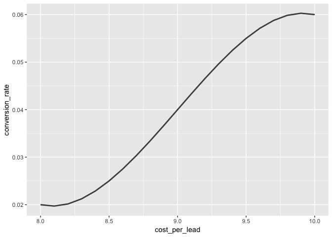

README
================

蒙特卡洛模拟可以帮助分析在商业上一些复杂的场景, 包括了衡量风险以及计算某项目在特定条件下可产生的收益. 我们将通过一个简化的例子表现蒙特卡洛模拟的应用.

Often, Monte Carlo simulation can come in handy to calculate risk or evaluate investments in projects. This is a simple demonstration.

背景
----

小象数据科学是刚成立不久的事业部. 主要针对9到12岁的儿童进行数据科学基础培训, 以促进培育国家未来数据人才的步伐. 经过3个月的试点, 管理层希望对业务采集的数据进行分析, 衡量该业务的风险点与可持续性.

你作为商业分析组的一员, 将通过数据模拟优先回答以下问题:

1.  以【月】为单位的利润是怎么样的一个**分布**? 以百分之**95的置信度**而言, 利润在什么**范围区间**?

解答: 服从正太分布

``` r
library(tidyverse)
```

    ## ─ Attaching packages ─────────────────────────────────────── tidyverse 1.2.1 ─

    ## ✔ ggplot2 3.1.0     ✔ purrr   0.3.2
    ## ✔ tibble  2.0.0     ✔ dplyr   0.7.8
    ## ✔ tidyr   0.8.2     ✔ stringr 1.3.1
    ## ✔ readr   1.3.1     ✔ forcats 0.3.0

    ## ─ Conflicts ──────────────────────────────────────── tidyverse_conflicts() ─
    ## ✖ dplyr::filter() masks stats::filter()
    ## ✖ dplyr::lag()    masks stats::lag()

``` r
library(ggthemes)
library(ggplot2)    
library(rio)
library(infer)
set.seed(1212)
N=1000
R=rnorm(N, mean=0.4, sd=0.05)
M=runif(5,350,400)
L=runif(5,3000,4000) 
S=L*R #收入
INCOME=M*S
Cpl=runif(5,8,10)
H=20000
Expenses=Cpl*L+H #成本
Profit=INCOME-Expenses
```

1.  如果我们设置一个月的**利润目标为10万元**, **达成目标的概率**是多少? **亏损风险** (利润小于0的概率) 是多少?

2.  利润的**累积分布函数** (cumulative distribution)? （绘图即可）

3.  经过第一轮的探索, 你与业务分享你的结果. 业务发现你的模拟出现了严重的漏洞. 以他们的业务经验, **单个栗子的成本与其转化率是强关联关系的**. 你提取了以往投放的数据 (见附带表格 csv), 发现果真如此. 于是, 你更新了你的模型. **请以新模型回答以上3点问题**.

``` r
data <- read.csv("Data/cpl_and_conversion.csv")
cor_matr = cor(data) #相关矩阵
cor_matr
```

    ##                 cost_per_lead conversion_rate
    ## cost_per_lead       1.0000000       0.9882867
    ## conversion_rate     0.9882867       1.0000000

``` r
data %>% 
ggplot(aes(cost_per_lead, conversion_rate)) +
  geom_line(size = 1, color = "grey30") #数据实际分布图
```



``` r
test_mod <- lm(conversion_rate ~ cost_per_lead, data = data) #线性预测？
test_mod
```

    ## 
    ## Call:
    ## lm(formula = conversion_rate ~ cost_per_lead, data = data)
    ## 
    ## Coefficients:
    ##   (Intercept)  cost_per_lead  
    ##      -0.18104        0.02456

``` r
predict(test_mod,newdata=data.frame(cost_per_lead=9.8),interval="confidence")
```

    ##          fit       lwr        upr
    ## 1 0.05964785 0.0578207 0.06147499

``` r
knitr::opts_chunk$set(echo = FALSE)
```

1.  如果业务提出一个产品方案, 在**增加固定成本百分之25至30**的前提下, 每天的**栗子数量可以提升百分之15至25**. 请问你会如何评估该方案?

2.  管理层认为单个栗子的成本过高, 具有很大的优化空间. 他们希望把**亏损风险控制在百分之35之内**. 请问根据该需求, **单个栗子成本的上线**是多少?

业务信息
--------

利润 (Profit) = 收入 (Revenue) - 开销 (Expenses)

注意: 这里所有指标均以【天】为单位

    * 收入为个单毛利 (Profit margin, M) 乘与销量 (Sales, S);

        * 个单毛利为均匀 (uniform) 分布, 一单 350 元至 400 元;
        
        * 销量为栗子数量 (Number of leads, L) 乘与转化率 (Conversion rate, R);
        
        * 栗子数量为均匀分布, 一天 3000 个至 4000 个;
        
        * 转化率为正态 (normal) 分布, 均值为 4%, 偏差为 0.5%;
        
    * 开销为固定成本 (Fixed overheads, H) 加上栗子成本;

        * 固定成本 (研发, 办公) 平摊为每天 2 万元;
        
        * 栗子成本为栗子数量乘于单个栗子成本 (Cost per lead, Cpl);
        
        * 单个栗子成本为均匀分布, 单个 8 元至 10 元;

------------------------------------------------------------------------

    Profit = Income - Expenses

        Income = Profit Margin per Sale (M) * Sales (S)
        
            M assumes an uniform dist. from $350 to $400
        
            S = Number of Leads (L) * Conversion Rate (R)
        
                 L assumes an uniform dist. with from 3000 to 4000
                 
                 R assumes a normal dist. with mean of 4% and sd of 0.5%
            
        Expenses = Fixed Overhead (H) + Total Cost of the Leads (C)
        
                H assumes a constant of $20000
                
                C = Cost Per Lead (Cpl) * Number of Leads (L)
                
                    Cpl assumes an uniform dist. from $8 to $10

    Profit = Leads * Conversion Rate * Profit Margin per Sale - (Cost per Lead * Leads + Fixed Overhead)

帮助
----

你可能会用到一下函数：

`sample` `replicate` `which` `rnorm` `runif` `rbeta` `lm` `predict` `geom_point` `geom_line` `stat_ecdf`

请设置随机种子为 **1212**
